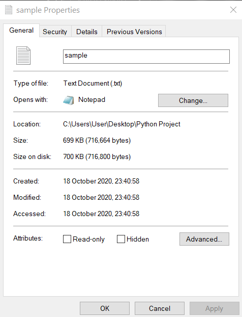
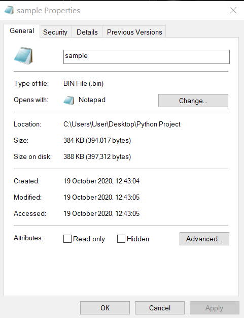
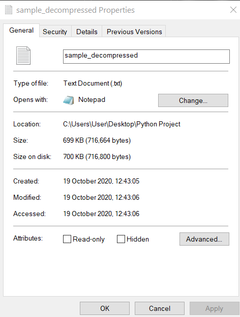

<div align="center">

<p style="font-size: 60px"><b>Huffman Coding</b></p>


</div>

<p>Huffman coding is a lossless data compression algorithm. In this algorithm, a variable-length code is assigned to input different characters. The code length is related to how frequently characters are used. Most frequent characters have the smallest codes and longer codes for least frequent characters</p>

<p>We create a frequency hashmap for all the characters in the string and then use data structures such as Min-Heap and Tree to convert these into binary codes. These binary codes are to be stored as bytes hence they are padded with zeros (to avoid default padding snce 1 byte=8 bits). This file is now compressed and has lesser size.</p>

## Data Structures used-
* Tree
* HashMap
* Min Heap

## Theory
### Step-1:
* Make a frequency table for all the characters in the string.
### Step-2:
* Pick the two smallest frequencies and make their nodes in the tree.
* Make another nodes with their combined frequencies and add it to the tree as well as to the frequency table.
* Connect the two nodes to this node with combined frequencies.
### Step-3:
* Again pick two smallest frequencies and continue the process till all the frequencies in the table are used.
### Step-4:
* Add weights to the branches of the Tree. Add weight 0 to all the left branches and 1 to all the right branches.
### Step-5:
* We can then get a code for each character just by following the path on the resultant tree.
* Make a map using this.

### Step-6:
* We then pad these codes with zeros to avoid default padding as we have to store these as bytes and 1 byte = 8bits.

### Step-7:
* We now convert the binary codes to bytes using `int(byte, 2)` and store it in the bytes array.

## Decompression of codes:
* We remove the padding and decode the binary codes.
* We then use the `reverse_mapping` hashmap to convert the codes back to text.

## Output:
* When we run the `useHuffman.py`, two files are created.
1. `sample.bin` -> binary file with less size
1. `sample_decompressed.txt` -> decompressed text file

<html>
  <body>
    <table width="100%" border="0">
      <tr>
        <td></td>
        <td></td>
        <td></td>
      </tr>
    </table>
  </body>
</html>

# Environment Setup and Local Installation:
1. Drop a :star: on the Github Repository.

1.  Make sure to install python on your system- https://www.python.org/downloads/ </br>

1. Download Python IDE or code editor for python code <br/>
*	[Install Anaconda for Windows](https://docs.anaconda.com/anaconda/install/windows/) <br/>
*	[Install Anaconda for MacOS](https://docs.anaconda.com/anaconda/install/mac-os/) <br/>
*	[Install Anaconda for Linux](https://docs.anaconda.com/anaconda/install/linux/) <br/>
*	[Install VS code for Windows/Mac/Linux](https://code.visualstudio.com/Download) </br>

1. Clone the Repo by going to your local Git Client and pushing this command: <br/>
	```git clone https://github.com/Pranav016/Huffman-Coding.git```

1. Clone the Repo to a particular folder on your system by going to your local Git Client and pushing this command: <br/>
	```git clone https://github.com/Pranav016/Huffman-Coding.git  <folder-name>```

1. Open the project in the Jupyter Notebook/VS code to use it.
    Entry file- useHuffman.py